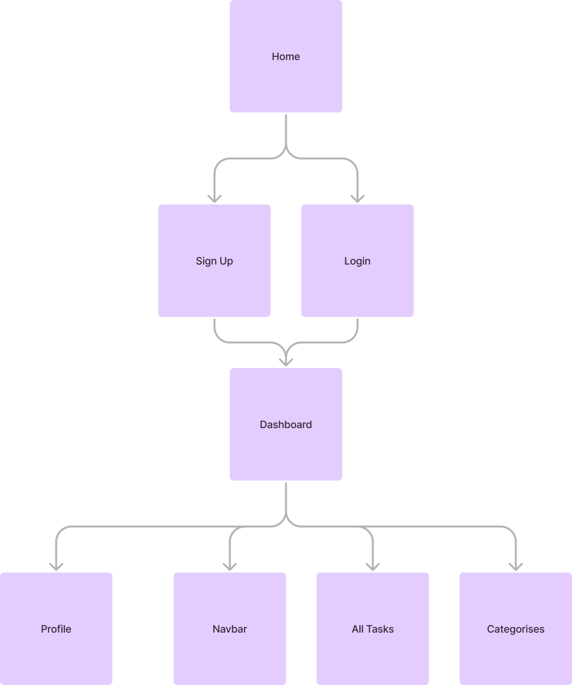

My original project for my Full Stack Development Diploma was a Todo List, crafted with HTML, CSS, and Javascript. I'm currently elevating the project by implementing React.js and integrating Appwrite for enhanced functionalities like user authentication and database management.
[Original Repo](https://github.com/EdwardShanahan07/my-todo-list)

# My Task List

The task list app allows users to create categories and add to-do items for each specific task. The application is developed using React for the front end and Appwrite for the backend.

## Contents

- [Design](#design)
  - [ERD](#erd)
  - [Site Map](#site-map)

## Design

### ERD

| User     | Category     | Task             |
| -------- | ------------ | ---------------- |
| id (PK)  | id (PK)      | id (PK)          |
| username | name         | name             |
| email    | user_id (FK) | status           |
| password |              | category_id (FK) |
|          |              | user_id (FK)     |

### Site Map

